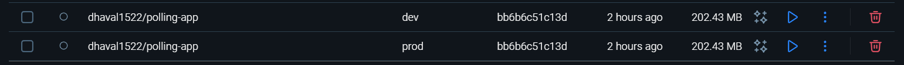
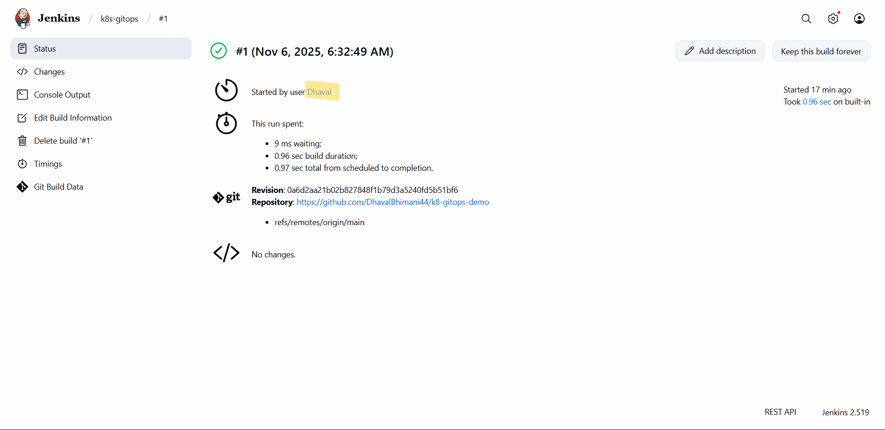
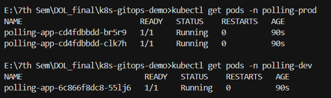

# DevOps End Semester Examination Lab-1

This project demonstrates a basic DevOps pipeline using Docker, Kubernetes, and Jenkins. It includes a simple Python application with containerization and Kubernetes deployment configurations for both development and production environments.

## Project Structure

- `app/`: Contains the Python application, Dockerfile, and requirements
- `k8s/`: Kubernetes configuration files
  - `dev/`: Development environment configurations
  - `prod/`: Production environment configurations

## Project Images

Below are the images showing different parts of the project setup and pipeline execution:

### 🐳 Docker Image

### ⚙️ Jenkins Pipeline

### ☸️ Kubernetes Pods

## Task 7 Details

The project implements a complete CI/CD pipeline using:

- Containerization with Docker
- Kubernetes deployments for dev and prod environments
- Jenkins pipeline for automated builds and deployments
- Separate namespace configurations for isolation

---

**Submitted by:**

- Name: Dhaval Bhimani
- PRN: 22070122051
- Task No: 7
